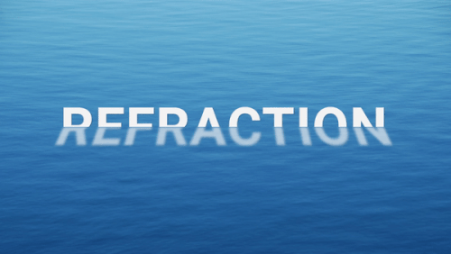

# Refracted Floating Text Effect
This project demonstrates how pure CSS can be used to create an animated refracted floating text effect.

## Live Demo
A live demo is available on [CodePen](https://cdpn.io/wEQpmo).

## License
This project is licensed under the MIT License - see the [license.md](license.md) file for details.
